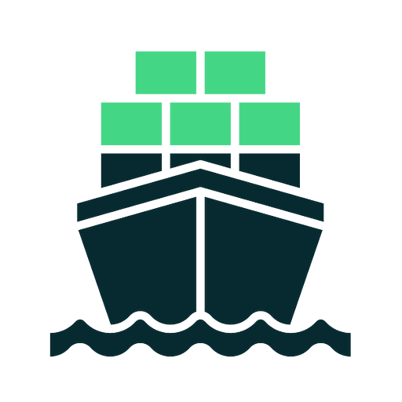

  

<h1 align="center">Galacius</h1>

  A lightweight, native desktop dashboard for Kubernetes clusters. 
  Built with Wails — Go backend, React webview, no Electron.

  
  
  
  

  

---

https://github.com/user-attachments/assets/97f02acb-d5e5-488a-a65a-610a897c4130

## Installation

See [docs/installation.md](docs/installation.md), or https://galacius.github.io/#installation for Homebrew/APT.

## Uninstallation

See [docs/uninstallation.md](docs/uninstallation.md).

## Architecture

Galacius has no HTTP/REST layer between its frontend and backend. Wails
auto-generates TypeScript bindings for every exported Go method, so the React
frontend calls Go directly as if it were a local async function; Go, in turn,
watches the Kubernetes API via informers and pushes live updates back to the
frontend as Wails events, rather than the frontend polling for changes.

<picture>
  <source media="(prefers-color-scheme: dark)" srcset="docs/architecture/architecture-dark.svg" />
  
</picture>

- **Request/response**: the frontend calls a bound Go method (e.g.
  `GetPods(namespace)`) through the Wails-generated bindings; Go runs it and
  returns the result over the same call, same as awaiting a local function.
- **Push updates**: Go's informers watch the cluster in the background and
  emit Wails events (e.g. `pods:update`) whenever cluster state changes; the
  frontend's per-resource event hooks subscribe to these events and merge the
  pushed payload into the existing TanStack Query cache, so views stay live
  without re-polling.

## Contributing

We welcome contributions! See [CONTRIBUTING.md](CONTRIBUTING.md) for setup,
testing, and PR guidelines. Please also review our
[Code of Conduct](CODE_OF_CONDUCT.md) and [Security Policy](SECURITY.md).

## License

Galacius is licensed under the [Apache License 2.0](LICENSE).
